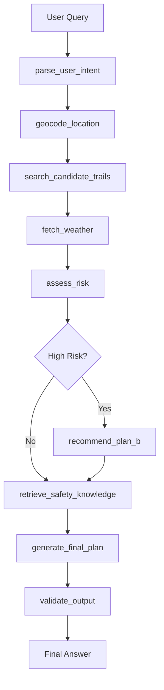

# TrailMind：基于 LangGraph 的户外徒步规划与风险评估 Agent

TrailMind 是一个面向户外徒步场景的智能规划 Agent。系统能够根据用户的自然语言需求，自动完成徒步意图解析、地点定位、候选路线生成、天气查询、风险评估、安全建议检索、Plan B 推荐，并通过 Streamlit + Folium 前端展示路线地图、候选轨迹、风险等级、装备建议和 LangGraph 工作流轨迹。

当前版本已经从简单的 `create_agent` 工具调用 Demo 升级为 **LangGraph 可控工作流**：工具调用顺序由图结构控制，LLM 主要负责意图解析和最终自然语言生成，路线规划、天气查询、风险评分和高风险分支由代码确定性执行。

---

## 1. 项目亮点

- **LangGraph 工作流编排**：将徒步规划拆解为意图解析、地点解析、路线规划、天气查询、风险评估、安全知识检索、Plan B 和输出校验等节点。
- **多工具调用**：集成地点解析、OpenRouteService 路线规划、Open-Meteo 天气查询、规则风险评估等工具。
- **完整路线生成**：使用 OpenRouteService `round_trip` 生成完整环线，避免直接使用 Overpass API 时返回大量短小道路片段的问题。
- **确定性风险评分**：综合降水概率、风速、气温、紫外线、路线距离、用户水平等因素输出风险等级和装备建议。
- **高风险条件分支**：当降雨、强风、高温或风险等级触发阈值时，自动进入 Plan B 节点。
- **地图可视化**：使用 Folium + Streamlit-Folium 展示候选路线轨迹，并支持地图内按钮切换不同候选轨迹。
- **工具调用可观测**：前端展示 LangGraph 每个节点的输入、输出和执行状态，便于调试和项目展示。

---

## 2. 功能概览

用户输入示例：

```text
我周末想在杭州西湖附近徒步，新手，3小时以内，帮我判断是否适合。
```

系统输出包括：

- 识别地点和经纬度
- 生成候选徒步环线
- 地图展示候选轨迹
- 查询未来周末天气
- 输出风险等级和风险分数
- 给出主要风险原因
- 给出装备建议
- 高风险时生成 Plan B
- 展示完整 LangGraph 工作流轨迹

---

## 3. 技术栈

| 模块 | 技术 |
|---|---|
| Agent 工作流 | LangGraph |
| LLM 接入 | LangChain + ChatAnthropic 兼容接口 |
| 默认模型 | MiniMax-M2.7，可通过 `.env` 配置 |
| 地点解析 | Nominatim + 内置地点别名兜底 |
| 路线规划 | OpenRouteService Directions API / round_trip |
| 天气查询 | Open-Meteo Forecast API |
| 风险评估 | Python 规则模型 |
| 前端 | Streamlit |
| 地图展示 | Folium + streamlit-folium |
| HTTP 请求 | requests |
| 配置管理 | python-dotenv |

---

## 4. 系统架构



节点说明：

| 节点 | 作用 |
|---|---|
| `parse_user_intent` | 从用户自然语言中提取地点、日期、体能水平、时长限制和偏好 |
| `geocode_location` | 将地点文本解析为经纬度 |
| `search_candidate_trails` | 使用 OpenRouteService 生成候选徒步环线 |
| `fetch_weather` | 查询未来天气数据 |
| `assess_risk` | 根据天气、路线和用户水平进行风险评分 |
| `recommend_plan_b` | 高风险时生成替代方案 |
| `retrieve_safety_knowledge` | 根据风险类型检索安全建议，目前为轻量规则检索 |
| `generate_final_plan` | 基于结构化状态生成最终 Markdown 回答 |
| `validate_output` | 校验最终回答是否包含必要章节 |

---

## 5. 当前项目结构

```text
trailmind-agent/
├── requirements.txt
├── run_cli.py
├── .env
│
├── app/
│   ├── __init__.py
│   ├── config.py
│   │
│   ├── agent/
│   │   ├── __init__.py
│   │   ├── state.py              # LangGraph 全局状态定义
│   │   ├── prompts.py            # 意图解析、最终生成、输出校验提示词
│   │   ├── graph.py              # LangGraph 工作流主入口
│   │   └── trail_agent.py        # 旧版 create_agent 实现，可作为历史版本保留
│   │
│   └── tools/
│       ├── __init__.py
│       ├── geocode_tool.py       # 地点解析工具
│       ├── weather_tool.py       # Open-Meteo 天气查询工具
│       ├── risk_tool.py          # 徒步风险评估工具
│       ├── trail_search_tool.py  # Overpass 路线检索工具，当前作为备用/历史版本
│       └── route_planner_tool.py # OpenRouteService 环线路线规划工具
│
└── frontend/
    ├── streamlit_app.py          # Streamlit 前端页面
    └── components/
        ├── __init__.py
        └── map_view.py           # Folium 地图与候选轨迹切换控件
```

> 注意：实际提交 GitHub 时不应提交 `.env`、`.venv/`、`__pycache__/` 等文件。建议新增 `.gitignore` 和 `.env.example`。

---

## 6. 环境准备

### 6.1 Python 版本

推荐使用 Python 3.11。

```bash
python3.11 --version
```

### 6.2 创建虚拟环境

```bash
cd trailmind-agent
python3.11 -m venv .venv
source .venv/bin/activate
pip install -U pip
pip install -U -r requirements.txt
```

---

## 7. 配置环境变量

在项目根目录创建 `.env`：

```bash
API_KEY=你的大模型APIKey
BASE_URL=你的大模型BaseURL
MODEL=MiniMax-M2.7
ORS_API_KEY=你的OpenRouteService_API_Key
```

字段说明：

| 变量 | 说明 |
|---|---|
| `API_KEY` | LLM 网关或模型服务的 API Key |
| `BASE_URL` | LLM 兼容接口地址，代码中会将 `/api/v1` 转换为 Anthropic 兼容 `/api` |
| `MODEL` | 模型名称，默认 `MiniMax-M2.7` |
| `ORS_API_KEY` | OpenRouteService API Key，用于生成候选徒步环线 |

建议创建 `.env.example`：

```bash
API_KEY=your_llm_api_key
BASE_URL=https://your-base-url/api/v1
MODEL=MiniMax-M2.7
ORS_API_KEY=your_openrouteservice_api_key
```

---

## 8. 运行方式

### 8.1 命令行运行

```bash
source .venv/bin/activate
python run_cli.py
```

也可以传入自定义问题：

```bash
python run_cli.py "我周末想在杭州西湖附近徒步，新手，3小时以内，帮我判断是否适合。"
```

CLI 会输出：

- LangGraph Agent 最终回答
- 选中路线
- 风险报告
- Plan B
- 工作流轨迹
- 错误或兜底信息

### 8.2 Streamlit 前端运行

```bash
source .venv/bin/activate
streamlit run frontend/streamlit_app.py
```

前端页面包含：

- 徒步需求输入框
- 规划摘要卡片
- Agent 最终输出
- 候选路线地图
- 推荐路线详情
- 候选路线列表
- 风险评估、天气、Plan B、安全知识 tabs
- LangGraph 工作流轨迹
- 完整 State 调试信息

---

## 9. 路线规划设计

早期版本直接使用 OpenStreetMap / Overpass API 查询：

```text
relation["route"="hiking"]
way["highway"="path"]
way["highway"="footway"]
way["highway"="track"]
```

但在城市景区中，这种方式容易返回大量短小道路片段，不能形成完整徒步路线。因此当前版本升级为 OpenRouteService `round_trip` 路线生成方案。

路线生成流程：

```text
用户最大时长 + 用户水平
        ↓
估算目标距离，例如新手 3 km/h
        ↓
调用 OpenRouteService round_trip
        ↓
使用不同 seed 生成多条候选环线
        ↓
解析 distance、duration、GeoJSON geometry
        ↓
按距离接近目标值和是否超时进行排序
        ↓
选出推荐路线
```

例如用户输入“新手，3小时以内”：

```text
目标距离 = 3 小时 × 3 km/h = 9 km
```

系统会基于该目标距离生成多条候选环线，并返回：

- `distance_km`
- `estimated_duration_hours`
- `difficulty`
- `geometry`
- `score`
- `source_type = ors_round_trip`

> 当前 ORS 生成的是“基于路网的规划路线”，不是两步路、AllTrails 或 Wikiloc 这类平台上的人工精选轨迹。最终回答中会显式说明这一点。

---

## 10. 风险评估模型

风险评估工具位于：

```text
app/tools/risk_tool.py
```

输入包括：

- 最高温度
- 降水概率
- 最大风速
- 紫外线指数
- 用户水平
- 预计时长
- 路线距离
- 估算爬升

输出包括：

```json
{
  "risk_level": "高风险",
  "risk_score": 68,
  "main_risks": [
    "降水概率较高，路面湿滑风险明显",
    "紫外线较强，需要防晒"
  ],
  "recommendation": "不推荐按原计划出行，建议改期或选择城市公园、景区短线。",
  "recommend_go": false,
  "gear_advice": ["雨衣", "防水袋", "登山杖"]
}
```

高风险触发条件包括：

- `risk_level == 高风险`
- 降水概率大于等于 70%
- 最大风速大于等于 35 km/h
- 最高气温大于等于 35℃

触发后，LangGraph 会进入 `recommend_plan_b` 节点。

---

## 11. 地图展示

地图组件位于：

```text
frontend/components/map_view.py
```

实现能力：

- 使用 Folium 渲染路线地图
- 使用 `PolyLine` 绘制候选路线轨迹
- 起点和终点使用 `CircleMarker` 标记
- 在地图右上角注入自定义候选轨迹按钮
- 点击按钮只显示对应候选路线
- 点击“显示全部”展示全部候选路线
- 地图自动缩放到当前路线范围

候选路线 geometry 格式：

```python
[
    [30.2467, 120.1485],
    [30.2471, 120.1490],
    ...
]
```

---

## 12. 主要文件说明

### `app/agent/graph.py`

LangGraph 主工作流定义文件，负责：

- 初始化 LLM
- 定义节点函数
- 定义高风险条件分支
- 编译 StateGraph
- 提供 `run_graph(query)` 入口

### `app/agent/state.py`

定义 `HikingAgentState`，用于保存从用户输入到最终输出的所有中间状态。

### `app/agent/prompts.py`

包含：

- `INTENT_PARSE_PROMPT`
- `FINAL_PLAN_PROMPT`
- `OUTPUT_VALIDATE_PROMPT`

### `app/tools/geocode_tool.py`

地点解析工具。当前包含部分地点别名兜底，例如：

- 杭州西湖
- 浙江杭州西湖
- 北京香山

用于避免 Nominatim 对中文地点产生歧义匹配。

### `app/tools/route_planner_tool.py`

OpenRouteService 路线规划工具。核心函数：

```python
plan_round_trip_routes(...)
```

用于基于起点生成多条候选环线。

### `app/tools/weather_tool.py`

Open-Meteo 天气查询工具，返回未来周末天气摘要。

### `app/tools/risk_tool.py`

确定性风险评分工具，用规则模型输出风险等级、风险分数、装备建议和是否推荐出行。

### `frontend/streamlit_app.py`

Streamlit 前端入口。

### `frontend/components/map_view.py`

Folium 地图组件和候选路线切换控件。

---

## 13. 示例输出结构

最终回答会包含以下章节：

```markdown
## 地点识别

## 推荐路线

## 天气概况

## 风险评估

## 安全建议

## 装备建议

## Plan B

## 是否推荐出行
```

---

## 14. 常见问题与排查

### 14.1 `ORS_API_KEY 未配置`

检查 `.env`：

```bash
cat .env
```

确认包含：

```bash
ORS_API_KEY=你的OpenRouteService_API_Key
```

### 14.2 `NameError: fetch_weather is not defined`

说明 `app/agent/graph.py` 中缺少 `fetch_weather()` 节点函数，或该函数缩进错误。确认文件中存在顶格定义：

```python
def fetch_weather(state: HikingAgentState) -> dict:
    ...
```

### 14.3 地图没有轨迹

检查候选路线是否包含 geometry：

```bash
python - <<'PY'
from app.tools.route_planner_tool import plan_round_trip_routes

result = plan_round_trip_routes.invoke({
    "latitude": 30.2467,
    "longitude": 120.1485,
    "place_name": "杭州西湖",
    "user_level": "新手",
    "max_duration_hours": 3,
    "preference": "湖边 新手",
    "profile": "foot-walking",
    "route_count": 3,
})

for trail in result.get("trails", []):
    print(trail["name"], trail["geometry_points"], trail["geometry"][:2])
PY
```

如果 `geometry_points` 为 0，说明路线规划接口没有返回可绘制轨迹。

### 14.4 OpenRouteService 请求失败

可能原因：

- API Key 错误
- 免费额度耗尽
- 网络无法访问 ORS
- 起点附近路网不足
- `foot-hiking` profile 在城市区域不稳定

可以先使用 `foot-walking` profile。

### 14.5 不要提交敏感文件

建议新增 `.gitignore`：

```gitignore
.env
.venv/
__pycache__/
*.pyc
.DS_Store
.streamlit/secrets.toml
```

---

## 15. 当前局限

- OpenRouteService 生成的是路网规划路线，不是户外平台人工精选路线。
- 当前安全知识检索是规则式检索，还不是 Chroma / FAISS 向量 RAG。
- 暂未接入真实海拔爬升 API，`elevation_gain_m` 暂时使用保守估计。
- 暂未实现 FastAPI 后端接口。
- 暂未加入 SQLite / Redis 缓存。
- 暂未加入 pytest 自动化测试。
- 暂未支持 GPX / KML 上传和导出。

---

## 16. 后续规划

### 阶段 4：RAG 安全知识库

- 整理徒步安全 Markdown 文档
- 使用 Chroma / FAISS 建立向量索引
- 根据风险类型检索相关安全知识
- 最终回答中引用安全知识摘要

### 阶段 5：工程化与部署

- 使用 FastAPI 封装 `/api/plan`
- Streamlit 调用后端 API
- SQLite 缓存天气和路线结果
- 增加 pytest 测试
- 增加 Dockerfile 和 docker-compose.yml
- 增加 Demo 截图和 sample outputs

### 加分扩展

- GPX / KML 上传和解析
- GPX 导出
- OpenRouteService Elevation 或其他海拔服务
- MCP Server 封装
- 用户体能画像
- 历史规划记录

---

## 17. 简历描述参考

**TrailMind：基于 LangGraph 的户外徒步规划与风险评估 Agent**

基于 LangGraph 构建户外徒步规划 Agent，集成 LLM、地点解析、OpenRouteService 路线规划、Open-Meteo 天气查询、规则风险评估和 Streamlit 地图可视化，实现自然语言需求解析、候选路线生成、天气分析、风险评分、装备推荐和 Plan B 输出。系统支持工具调用轨迹展示、候选路线地图切换和完整工作流状态观测，提升了 Agent 系统的可控性、可解释性和工程展示价值。

简历 bullet：

```text
- 设计并实现基于 LangGraph 的多节点 Agent 工作流，将徒步规划拆解为意图解析、地点定位、路线生成、天气查询、风险评估、Plan B 和最终计划生成等节点，提升工具调用流程的可控性和可解释性。
- 封装 OpenRouteService round-trip 路线规划工具，根据用户时长和体能水平生成多条候选徒步环线，并解析距离、耗时和 GeoJSON 轨迹用于地图展示。
- 集成 Open-Meteo 天气预报和规则化风险评分模型，综合降水概率、风速、温度、紫外线、路线距离和用户水平输出风险等级、风险原因和装备建议。
- 使用 Streamlit + Folium 搭建可视化前端，支持候选路线地图展示、地图内轨迹切换、风险卡片、Plan B、安全知识和 LangGraph 工作流轨迹展示。
```

---

## 18. 许可证

当前项目用于学习、求职展示和技术验证。第三方 API 数据使用需遵守对应平台的服务条款。
