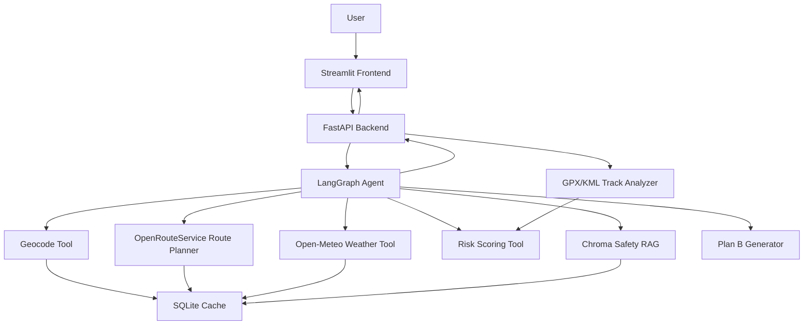
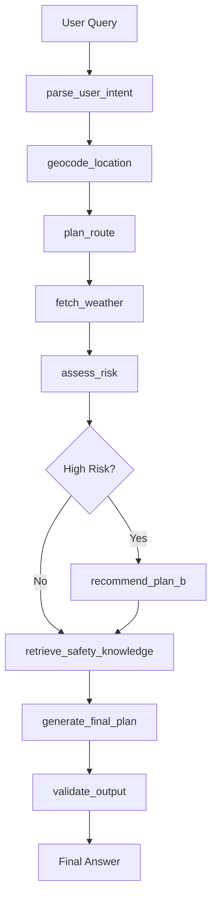

# TrailMind：基于 LangGraph 的户外徒步规划与风险评估 Agent

TrailMind 是一个面向户外徒步场景的智能规划 Agent。系统将用户的自然语言徒步需求拆解为地点解析、路线规划、天气查询、风险评估、RAG 安全知识检索、Plan B 生成和地图可视化等步骤，用于展示 Agent 工作流编排、外部工具调用、结构化风险评估和工程化交付能力。

当前项目已经从早期的 `create_agent` 工具调用 Demo 升级为 **LangGraph 可控工作流 + FastAPI 后端 + Streamlit 前端** 的完整工程雏形。LLM 主要负责意图解析和最终自然语言生成，地点解析、路线规划、天气查询、风险评分、RAG 检索和 Plan B 分支由代码节点确定性执行。

---

## 1. 项目定位

```text
TrailMind = 自然语言徒步需求
          + LangGraph Agent 工作流
          + OpenRouteService 路线规划
          + Open-Meteo 天气查询
          + 可解释风险评分
          + Chroma RAG 安全知识库
          + Streamlit/Folium 地图展示
          + FastAPI 服务封装
```

适合作为求职项目展示：

- Agent 工作流编排能力
- 多工具调用与状态管理能力
- 后端 API 封装能力
- 前端可视化展示能力
- RAG 知识增强能力
- 测试、缓存、部署等工程化意识

---

## 2. 当前实现状态

### 已实现

- [x] LangGraph 多节点 Agent 工作流
- [x] 用户自然语言意图解析
- [x] Nominatim + 本地别名地点解析
- [x] OpenRouteService 候选徒步路线规划
- [x] Open-Meteo 天气查询
- [x] 确定性风险评分模型
- [x] 高风险 Plan B 生成
- [x] Chroma + Markdown 安全知识库检索
- [x] SQLite 缓存系统
- [x] FastAPI 后端接口
- [x] Streamlit 前端页面
- [x] Folium/Leaflet 地图可视化
- [x] 候选路线切换展示
- [x] 安全知识来源展示
- [x] LangGraph 工具调用轨迹展示
- [x] GPX/KML 上传轨迹分析
- [x] 当前推荐路线 GPX 下载
- [x] pytest 基础测试目录

### 当前仍需完善

- [ ] Dockerfile / docker-compose.yml 一键启动
- [ ] GitHub Actions 自动测试
- [ ] Demo 截图与示例输出
- [ ] 更真实的海拔 / 爬升风险建模
- [ ] 第三方 API mock 测试
- [ ] 更完整的部署说明
- [ ] 前端展示进一步产品化

---

## 3. 功能概览

用户输入示例：

```text
我周末想在武汉东湖附近徒步，新手，4小时以内，帮我判断是否合适。
```

系统输出包括：

- 识别用户徒步意图：地点、日期、用户水平、时长限制、路线偏好
- 解析地点经纬度
- 生成候选徒步路线
- 查询未来天气
- 输出风险等级、风险分数和主要风险原因
- 给出装备建议和行动建议
- 高风险时生成 Plan B
- 检索相关安全知识并展示来源
- 在地图中展示候选路线轨迹
- 展示 LangGraph 工作流执行轨迹
- 支持上传 GPX/KML 轨迹进行风险分析
- 支持将推荐路线导出为 GPX

---

## 4. 技术栈

| 模块 | 技术 |
|---|---|
| Agent 工作流 | LangGraph |
| LLM 接入 | LangChain + ChatAnthropic 兼容接口 |
| 后端服务 | FastAPI |
| 前端 | Streamlit |
| 地图 | Folium / Leaflet / streamlit-folium |
| 地点解析 | Nominatim + 本地别名兜底 |
| 路线规划 | OpenRouteService |
| 天气查询 | Open-Meteo |
| 风险评估 | Python 规则评分模型 |
| RAG | Chroma + Markdown 知识库 |
| Embedding | HuggingFaceEmbeddings / sentence-transformers |
| 缓存 | SQLite |
| 轨迹文件 | GPX / KML |
| 测试 | pytest |
| 配置管理 | python-dotenv |

---

## 5. 系统架构



---

## 6. LangGraph 工作流



节点说明：

| 节点 | 作用 |
|---|---|
| `parse_user_intent` | 从自然语言中提取地点、日期、用户水平、时长限制和偏好 |
| `geocode_location` | 将地点文本解析为经纬度 |
| `plan_route` | 规划候选徒步路线 |
| `fetch_weather` | 查询天气数据 |
| `assess_risk` | 根据天气、路线和用户水平计算风险 |
| `recommend_plan_b` | 高风险时生成替代方案 |
| `retrieve_safety_knowledge` | 从 Chroma 安全知识库检索相关建议 |
| `generate_final_plan` | 生成最终 Markdown 规划结果 |
| `validate_output` | 校验输出是否包含必要章节 |

---

## 7. 项目结构

```text
trailmind-agent/
├── app/
│   ├── main.py                     # FastAPI 后端入口
│   ├── config.py                   # 环境变量与模型配置
│   │
│   ├── agent/
│   │   ├── graph.py                # LangGraph 工作流主入口
│   │   ├── prompts.py              # 意图解析、最终生成、校验提示词
│   │   └── state.py                # HikingAgentState 状态定义
│   │
│   ├── rag/
│   │   ├── build_index.py          # Chroma 索引构建
│   │   ├── retriever.py            # 安全知识检索
│   │   └── docs/                   # Markdown 安全知识文档
│   │
│   ├── schemas/
│   │   ├── request.py              # FastAPI 请求模型
│   │   └── response.py             # FastAPI 响应模型
│   │
│   ├── services/
│   │   └── cache.py                # SQLite 缓存
│   │
│   └── tools/
│       ├── geocode_tool.py         # 地点解析
│       ├── route_planner_tool.py   # ORS 路线规划
│       ├── weather_tool.py         # Open-Meteo 天气查询
│       ├── risk_tool.py            # 风险评分
│       └── gpx_tool.py             # GPX/KML 解析与 GPX 导出
│
├── frontend/
│   ├── streamlit_app.py            # Streamlit 前端
│   └── components/
│       └── map_view.py             # Folium 地图组件
│
├── tests/                          # pytest 测试
├── scripts/                        # 辅助脚本
├── run_cli.py                      # CLI 入口
├── requirements.txt                # Python 依赖
├── pytest.ini                      # pytest 配置
├── .env.example                    # 环境变量示例
├── .gitignore
└── README.md
```

---

## 8. 环境准备

推荐 Python 版本：

```bash
python3.11 --version
```

创建虚拟环境：

```bash
cd trailmind-agent

python3.11 -m venv .venv
source .venv/bin/activate

pip install -U pip
pip install -r requirements.txt
```

如果当前 `requirements.txt` 尚未包含 FastAPI / 测试相关依赖，可以先手动补装：

```bash
pip install fastapi uvicorn python-multipart pytest
```

建议后续将这些依赖同步写入 `requirements.txt`。

---

## 9. 环境变量配置

复制示例文件：

```bash
cp .env.example .env
```

`.env.example` 示例：

```env
# LLM config
API_KEY=your_llm_api_key
BASE_URL=https://your-base-url/api/v1
MODEL=MiniMax-M2.7

# OpenRouteService
ORS_API_KEY=your_openrouteservice_api_key

# RAG embedding model
RAG_EMBEDDING_MODEL=sentence-transformers/paraphrase-multilingual-MiniLM-L12-v2
```

字段说明：

| 变量 | 说明 |
|---|---|
| `API_KEY` | LLM 网关或模型服务 API Key |
| `BASE_URL` | LLM 兼容接口 Base URL |
| `MODEL` | 模型名称 |
| `ORS_API_KEY` | OpenRouteService API Key，用于路线规划 |
| `RAG_EMBEDDING_MODEL` | RAG embedding 模型 |

注意：不要提交 `.env`、真实 API Key、缓存数据库或 Chroma 索引目录。

---

## 10. 构建 RAG 安全知识索引

项目使用 `app/rag/docs/` 下的 Markdown 文档构建 Chroma 安全知识库。

构建索引：

```bash
python -m app.rag.build_index
```

索引默认写入：

```text
storage/chroma_safety/
```

该目录是运行时生成物，不建议提交到 GitHub。

---

## 11. CLI 运行

直接运行默认示例：

```bash
python run_cli.py
```

传入自定义问题：

```bash
python run_cli.py "我周末想在武汉东湖附近徒步，新手，4小时以内，帮我判断是否合适。"
```

建议固定验收输入：

```bash
python run_cli.py "我周末想在杭州西湖附近徒步，新手，3小时以内，帮我判断是否合适。"

python run_cli.py "我周末想在武汉东湖附近徒步，新手，4小时以内，帮我判断是否合适。"

python run_cli.py "我周末想在华中科技大学附近徒步，新手，3小时以内，帮我判断是否合适。"

python run_cli.py "我周末想在北京香山附近徒步，有经验，4小时以内，帮我判断是否合适。"
```

---

## 12. FastAPI 后端运行

启动后端：

```bash
python -m uvicorn app.main:app --reload --host 0.0.0.0 --port 8000
```

健康检查：

```bash
curl http://127.0.0.1:8000/api/health
```

自然语言规划接口：

```bash
curl -X POST http://127.0.0.1:8000/api/plan \
  -H "Content-Type: application/json" \
  -d '{"query":"我周末想在武汉东湖附近徒步，新手，4小时以内，帮我判断是否合适。"}'
```

上传 GPX/KML 轨迹分析接口：

```bash
curl -X POST http://127.0.0.1:8000/api/track/analyze \
  -F "file=@examples/sample_uploaded_track.gpx" \
  -F "user_level=新手"
```

---

## 13. Streamlit 前端运行

先启动 FastAPI 后端：

```bash
python -m uvicorn app.main:app --reload --host 0.0.0.0 --port 8000
```

再启动前端：

```bash
streamlit run frontend/streamlit_app.py
```

默认前端会调用：

```text
http://127.0.0.1:8000
```

如需修改后端地址：

```bash
export TRAILMIND_API_BASE_URL=http://127.0.0.1:8000
streamlit run frontend/streamlit_app.py
```

前端能力：

- 自然语言徒步规划
- FastAPI 后端连通性检查
- 候选路线地图展示
- 推荐路线详情
- 风险评估报告
- 天气摘要
- Plan B 展示
- RAG 安全知识来源展示
- LangGraph 工作流轨迹展示
- GPX/KML 上传轨迹分析
- 当前推荐路线 GPX 下载

---

## 14. 测试

运行全部测试：

```bash
pytest -q
```

当前测试目录包括：

```text
tests/
├── conftest.py
├── test_cache.py
├── test_geocode.py
├── test_gpx_tool.py
├── test_graph_flow.py
├── test_rag.py
├── test_risk.py
└── test_route_planner.py
```

建议测试分层：

```text
unit tests:
- 地点解析规则
- 风险评分
- GPX/KML 解析
- SQLite 缓存
- response schema

integration tests:
- OpenRouteService 真实调用
- Open-Meteo 真实调用
- Chroma RAG 索引与检索
- LLM 最终计划生成
```

涉及真实 API Key 的测试不应放入默认 CI；建议使用 mock 或手动 integration 测试。

---

## 15. Docker 运行说明

当前阶段建议补充以下文件：

```text
Dockerfile
docker-compose.yml
.dockerignore
```

目标运行方式：

```bash
docker compose up --build
```

目标服务：

```text
api       -> FastAPI 后端，端口 8000
frontend  -> Streamlit 前端，端口 8501
```

计划中的访问地址：

```text
http://127.0.0.1:8501
```

注意：如果当前仓库尚未包含 Dockerfile 和 docker-compose.yml，请先按后续工程化计划补齐后再使用 Docker 启动。

---

## 16. 缓存说明

项目使用 SQLite 缓存减少重复请求外部 API 和 RAG 检索开销。

缓存文件默认位于：

```text
storage/trailmind_cache.sqlite3
```

建议不要提交：

```text
storage/*.sqlite3
storage/chroma_safety/
```

---

## 17. 安全与 GitHub 提交检查

不要提交：

```text
.env
.venv/
storage/chroma_safety/
storage/*.sqlite3
__pycache__/
*.pyc
.DS_Store
.streamlit/secrets.toml
真实 API Key
大视频文件
模型缓存
```

建议提交：

```text
.env.example
README.md
requirements.txt
pytest.ini
run_cli.py
app/
frontend/
tests/
app/rag/docs/
.streamlit/config.toml
```

提交前检查：

```bash
git status

git ls-files | grep -E "\.env|\.venv|chroma_safety|sqlite|db|__pycache__|pyc"
```

如果敏感文件已经被跟踪：

```bash
git rm --cached .env
git rm -r --cached .venv
git rm -r --cached storage/chroma_safety
git rm --cached storage/*.sqlite3
```

---

## 18. 常见问题

### 18.1 FastAPI 后端连接失败

现象：Streamlit 提示无法连接后端。

处理：

```bash
python -m uvicorn app.main:app --reload --host 0.0.0.0 --port 8000
```

确认：

```bash
curl http://127.0.0.1:8000/api/health
```

### 18.2 OpenRouteService 请求失败

可能原因：

- `ORS_API_KEY` 未配置
- API Key 错误
- 免费额度耗尽
- 当前地点附近路网不足
- 网络无法访问 ORS

处理：

- 检查 `.env`
- 更换地点测试
- 降低路线距离或时长要求
- 使用固定验收用例排查

### 18.3 RAG 索引不存在

现象：安全知识检索失败或回退到规则建议。

处理：

```bash
python -m app.rag.build_index
```

### 18.4 sentence-transformers 模型下载失败

可能原因：

- 本地网络无法访问 Hugging Face
- 模型缓存不存在
- 企业内网限制外部下载

处理：

- 使用可访问网络预下载模型
- 配置 Hugging Face 镜像
- 将模型缓存保存在本地环境
- 暂时依赖规则兜底建议

### 18.5 上传 GPX/KML 失败

可能原因：

- 文件格式不合法
- 文件中没有有效轨迹点
- KML 坐标格式异常
- GPX 只包含 waypoint，没有 track segment

处理：

- 使用标准户外 App 导出的 GPX
- 检查文件中是否存在 `<trkpt>` 或有效 KML coordinates
- 尝试换用更短轨迹文件测试

---

## 19. 当前局限

- OpenRouteService 生成的是基于路网的规划路线，不是 AllTrails、Wikiloc、两步路等平台上的人工精选轨迹。
- 当前风险模型主要基于规则评分，适合解释和展示，但不是专业户外安全决策系统。
- 海拔 / 累计爬升建模仍需加强；如果轨迹或路线缺少 elevation 数据，系统应明确说明。
- 第三方 API 调用受网络、额度、Key 权限和服务稳定性影响。
- Docker Compose 与 GitHub Actions 尚需补齐。
- Demo 截图、示例输出和部署说明仍需完善。

---

## 20. 后续规划

### P0：工程化收口

- [ ] README 与代码状态保持一致
- [ ] 端到端验收 CLI / FastAPI / Streamlit / RAG / GPX / pytest
- [ ] 清理敏感文件和运行时缓存
- [ ] 修复 response schema 中的可变默认值

### P1：可复现部署与自动测试

- [ ] 补充 Dockerfile
- [ ] 补充 docker-compose.yml
- [ ] 补充 .dockerignore
- [ ] 增加 GitHub Actions
- [ ] 将外部 API 测试 mock 化

### P2：展示优化

- [ ] 增加 Demo 截图
- [ ] 增加 examples/sample_requests.json
- [ ] 增加 examples/sample_outputs.md
- [ ] 增加 examples/sample_uploaded_track.gpx
- [ ] 优化 Streamlit 页面布局和地图交互

### P3：高级扩展

- [ ] 更真实的海拔 / 爬升计算
- [ ] 多路线 provider：ORS / OSMnx / GPX
- [ ] 用户体能画像
- [ ] 历史规划记录
- [ ] LangGraph streaming 节点进度
- [ ] MCP Server 封装

---

## 21. 简历描述参考

### 一句话版本

TrailMind 是一个基于 LangGraph 的户外徒步规划与风险评估 Agent，集成路线规划、天气查询、RAG 安全知识库、风险评分、Plan B 生成和地图可视化，并通过 FastAPI + Streamlit 完成工程化封装。

### 项目描述版本

基于 LangGraph 构建多节点户外规划 Agent，将用户自然语言需求拆解为地点解析、路线规划、天气查询、风险评估、RAG 安全知识检索和 Plan B 生成等可控节点。系统集成 OpenRouteService 生成候选徒步路线，调用 Open-Meteo 查询天气，并基于降水、风速、温度、紫外线、路线距离、用户经验和轨迹信息构建可解释风险评分模型。引入 Chroma 安全知识库，针对高温、雷暴、长距离和新手风险检索安全建议，并在最终规划中展示知识来源。前端使用 Streamlit + Folium 实现多候选路线地图可视化、GPX/KML 上传分析、GPX 下载、工具调用轨迹展示和风险报告展示；后端通过 FastAPI 封装 Agent 能力，并结合 SQLite 缓存和 pytest 测试提升项目工程化程度。

### 简历 bullet

- 设计并实现基于 LangGraph 的多节点 Agent 工作流，将徒步规划拆解为意图解析、地点定位、路线生成、天气查询、风险评估、Plan B 和最终计划生成等节点，提高工具调用流程的可控性和可解释性。
- 封装 OpenRouteService 路线规划工具，根据用户时长和体能水平生成候选徒步路线，并解析距离、耗时和 GeoJSON 轨迹用于地图展示。
- 集成 Open-Meteo 天气预报和规则化风险评分模型，综合降水概率、风速、温度、紫外线、路线距离和用户水平输出风险等级、风险原因和装备建议。
- 引入 Chroma + Markdown 安全知识库，根据风险类型检索安全建议，并在最终规划中展示知识来源。
- 使用 FastAPI 封装 Agent 服务，使用 Streamlit + Folium 搭建可视化前端，支持 GPX/KML 上传轨迹分析、GPX 下载、候选路线地图展示和工具调用轨迹观测。

---

## 22. 许可证与免责声明

当前项目用于学习、求职展示和技术验证。第三方 API 数据使用需遵守对应平台的服务条款。

TrailMind 输出的风险评估和建议仅供参考，不能替代专业户外领队、安全机构、景区公告或气象预警。实际出行前请确认当地天气、交通、景区开放情况和个人身体状况。